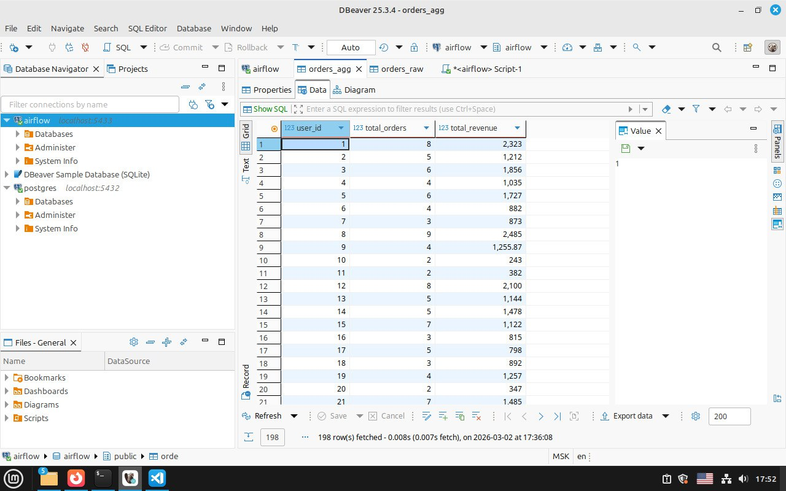

# Тестовое задание — стажёр Data Engineer
## Блок 1 — SQL анализ и валидация данных

### 1. Развёртывание окружения
Для выполнения задания я поднял полностью изолированное окружение с помощью **Docker Compose**.

**Что было развернуто:**
- **PostgreSQL 16** — основная база данных
- **Apache Airflow 2.11.1** (не был использован)

**Ключевые настройки:**
- Postgres доступен на порту **`5433`** (чтобы не конфликтовал с другими проектами)
- Airflow Web UI доступен на порту **`8081`** ( порт аналогично выбран в избежание конфликтов с другими проектами)
- Использован официальный образ Airflow с минимальными изменениями

### 2. Импортированы данные:
   - `orders_raw.csv` и `orders_agg.csv` скопированы в контейнер Postgres и загружены в таблицы `orders_raw` и `orders_agg` .
   - Проверил данные через GUI а именно DBeaver, как видно на скриншоте:
   - 

### 3. Непосредственное задание
   - выполнены контрольные SQL-запросы по количеству строк и поиску несоответствий между `orders_raw` и `orders_agg`.
   - результаты проверены через GUI — `DBeaver`.

## Блок 2 — Python + Pandas: отчёт и трансформация

Код с комментариями в `generate_user_report.py`

Результат в `user_report.csv`

| user_id | views | clicks | purchases | avg_interval_sec | first_event | last_event |
|---------|-------|--------|-----------|------------------|-------------|------------|
| 1000 | 50 | 23 |   8 |   7480.975 |2024-05-01 00:34:01 | 2024-05-07 22:48:39 |
| 1001 | 41 | 18 |   5 |   8919.698412698413 |2024-05-01 00:15:13 |2024-05-07 12:20:54 |
| 1002 | 35 | 16 |   3 |   8672.396226415094 |2024-05-02 10:25:18 | 2024-05-07 18:05:55 |
| ... | ... | ... | ...| ... | ... | ... |

## Блок 3 — Разбор чужого DAG'а (Airflow)

СТЕК ТЕХНОЛОГИЙ: Docker, Apache Airflow, PostgreSQL и DBeaver.
