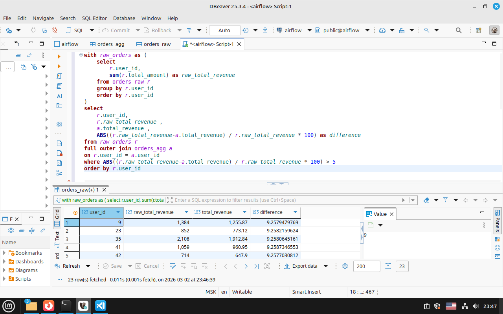

# Тестовое задание : Блок 1 — SQL анализ и валидация данных

## Задание 1:
Найди пользователей, у которых расхождение между `orders_agg.total_orders` и реальным количеством заказов в `orders_raw`
### Вариант 1

```sql
select 
	r.user_id,
	COUNT(r.order_id) as raw_total_orders,
	MAX(a.total_orders) as agg_total_orders
from orders_raw r
full outer join orders_agg a 
on r.user_id = a.user_id
group by r.user_id
having COUNT(r.order_id)!=MAX(a.total_orders)
order by r.user_id 
```

Пояснение: 
Мы берём всех пользователей из двух таблиц сразу (FULL OUTER JOIN), причем даже если пользователь есть только в одной таблице, он всё равно попадёт в результат.
Для каждого пользователя считаем:
- raw_total_orders = сколько заказов реально есть в сырой таблице 
- agg_total_orders = сколько заказов записано в сводной таблице
  
Далее мы группируем всё по пользователю и оставляем только тех, у кого реальное количество заказов не равно тому, что написано в агрегированной таблице.
Сортируем по user_id.

Вывод на скриншоте:


### Вариант 2

```sql
with raw_orders as (
	select 
		r.user_id,
		COUNT(r.order_id) as raw_total_orders
	from orders_raw r
	group by r.user_id
	order by r.user_id
)
select 
	r.user_id,
	r.raw_total_orders,
	a.total_orders
from raw_orders r
full outer join orders_agg a 
on r.user_id = a.user_id
where r.raw_total_orders!=a.total_orders 
order by r.user_id
```

Пояснение: Сначала мы считаем реальное количество заказов для каждого пользователя и сохраняем это в временную таблицу под названием raw_orders, после присоединяем к ней таблицу orders_agg и оставляем только тех пользователей, у кого цифры не совпадают. (WHERE r.raw_total_orders != a.total_orders)

Вывод на скриншоте:


## Задание 2:
Найди таких пользователей, у которых расхождение по выручке более чем на 5%

```sql
with raw_orders as (
	select 
		r.user_id,
		sum(r.total_amount) as raw_total_revenue
	from orders_raw r
	group by r.user_id
	order by r.user_id
)
select 
	r.user_id,
	r.raw_total_revenue ,
	a.total_revenue ,
	ABS((r.raw_total_revenue-a.total_revenue) / r.raw_total_revenue * 100) as difference
from raw_orders r
full outer join orders_agg a
on r.user_id = a.user_id
where ABS((r.raw_total_revenue-a.total_revenue) / r.raw_total_revenue * 100) > 5
order by r.user_id 
```

Пояснение:

Сначала мы считаем реальную выручку для каждого пользователя из таблицы orders_raw и сохраняем это во временную табличку raw_orders.
Далее соединяем реальную выручку со сводной таблицей. Берем FULL JOIN, чтобы не потерять юзеров, которые есть только в одной из таблиц.
Потом считаем процент расхождения: Берём разницу между реальной и агрегированной суммой делим это на реальную сумму и умножаем на 100 (чтобы получить проценты) и берем модуль для положительного числа.
Далее оставляет только тех пользователей, у кого расхождение больше 5% и сортируем результат по id юзеров.

Вывод на скриншоте:



## Задание 3:
Объясни возможные причины таких расхождений (не менее 3 причин)

Для начала стоит проверить нет ли у нас дубликатов:

```sql
select count(order_id),count(distinct order_id) from orders_raw
```


